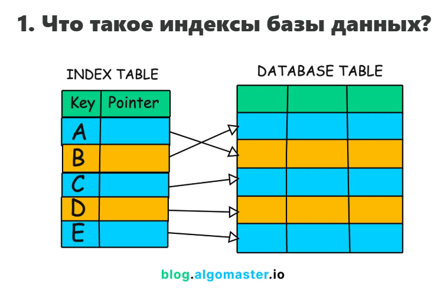

# Что такое индексы в базах данных и для чего они? Если у нас PostgreSQL, то как их создать? 

Вот разъяснения по каждому из ваших вопросов с учетом использования PostgreSQL и Spring Boot с Kotlin:

1. Что такое индексы в базах данных и для чего они нужны? Как их создать в Postgres?
- Индекс — это структура данных, которая ускоряет поиск и выборку данных в базе, подобно содержанию в книге, позволяя быстро находить нужные записи без полного просмотра таблицы.
- Индексы баз данных работают аналогично страницам содержания в книге. Они указывают базе данных точное местоположение данных, обеспечивая более быстрый и эффективный поиск данных.
- Индексы повышают производительность запросов, уменьшая объем сканируемых данных, обеспечивают эффективную сортировку и упорядочивание, но занимают дополнительное место и увеличивают время операций записи.
- Индекс базы данных — это сверхэффективная таблица поиска, которая позволяет базе данных находить данные гораздо быстрее.
Он (индекс) содержит индексированные значения столбцов вместе с указателями на соответствующие строки в таблице.
Без индекса базе данных, возможно, придется сканировать каждую отдельную строку в огромной таблице, чтобы найти то, что вам нужно, — а это крайне медленный процесс.
Однако при использовании индекса база данных может точно определить местоположение нужных данных, используя указатели индекса.

- В PostgreSQL индекс создается с помощью команды `CREATE INDEX`, например:
```sql
CREATE INDEX idx_column_name ON table_name(column_name);
```
Например, для таблицы:
```sql
CREATE TABLE employees (
    id INT PRIMARY KEY,
    first_name VARCHAR(50),
    last_name VARCHAR(50),
    email VARCHAR(100),
    department VARCHAR(50),
    salary DECIMAL(10, 2)
);
```
создаем индекс для колонки `last_name`:
```sql
CREATE INDEX idx_last_name ON employees (last_name);
```
Индекс создаётся по last_name столбцу.
После создания индекса запросы, включающие условия или сортировку по last_nameстолбцу, будут оптимизированы. Например:
```sql
SELECT * FROM employees WHERE last_name='Smith';
```
Этот запрос будет использовать idx_last_name индекс для быстрого поиска строк, в которых last_name содержится «Smith», избегая полного сканирования таблицы.
- Вы также можете создавать индексы по нескольким столбцам (составные индексы), если ваши запросы часто содержат условия по нескольким столбцам одновременно. <br>
Например:
```sql
CREATE INDEX idx_full_name ON employees (first_name, last_name);
```
Это создает составной индекс по столбцам `first_name` и `last_name`, который может быть полезен для запросов, которые выполняют поиск или сортировку на основе обоих столбцов.
- По умолчанию создается B-tree индекс, подходящий для большинства случаев. Можно создавать уникальные индексы, мультирекордные и частичные.
- Создание индекса:
  - индексы могут значительно повысить производительность запросов, особенно для больших наборов данных, за счет сокращения объема данных, которые необходимо сканировать 
  - ускорит запросы по индексированным столбцам, как показано на примере создания индекса на столбце `phone` в таблице `address`.[1][2][3][4]
  - индексы также можно использовать для эффективной сортировки данных на основе индексированных столбцов, устраняя необходимость в дорогостоящих операциях сортировки
  - индексы обеспечивают быстрый поиск данных для запросов, в которых используются условия равенства или диапазона для индексированных столбцов

### Какую структуру данных используют индексы?

")


[1](https://blog.algomaster.io/p/a-detailed-guide-on-database-indexes)
[2](https://neon.com/postgresql/postgresql-indexes/postgresql-create-index)
[3](https://www.postgresql.org/docs/current/sql-createindex.html)
[4](https://postgrespro.ru/docs/postgresql/current/sql-createindex)


[12](https://stackoverflow.com/questions/129329/optimistic-vs-pessimistic-locking)
[13](https://www.youtube.com/watch?v=lR6y-0RC5cc)
[14](https://www.ibm.com/docs/en/rational-clearquest/10.0.7?topic=clearquest-optimistic-pessimistic-record-locking)
[15](https://www.baeldung.com/jpa-optimistic-locking)
[16](https://www.tune-it.ru/web/dashezunka/blog/-/blogs/optimistic-vs-pessimistic-locking-v-sql)
[17](https://planetscale.com/blog/how-do-database-indexes-work)
[18](https://en.wikipedia.org/wiki/Partition_(database))
[19](https://stackoverflow.com/questions/51004552/create-a-partition-table-in-postgresql)
[20](https://en.wikipedia.org/wiki/Database_index)