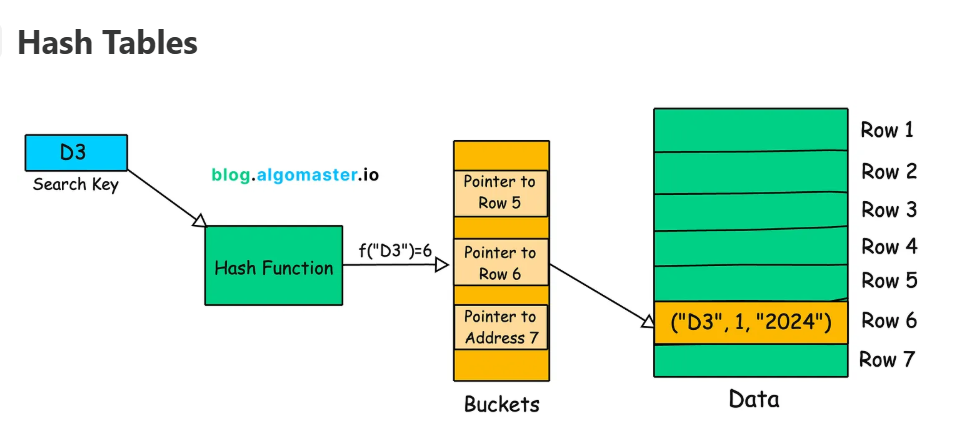

# Что такое индексы в базах данных и для чего они? Если у нас PostgreSQL, то как их создать? 

Вот разъяснения по каждому из ваших вопросов с учетом использования PostgreSQL и Spring Boot с Kotlin:

1. Что такое индексы в базах данных и для чего они нужны? Как их создать в Postgres?
- Индекс — это структура данных, которая ускоряет поиск и выборку данных в базе, подобно содержанию в книге, позволяя быстро находить нужные записи без полного просмотра таблицы.
- Индексы баз данных работают аналогично страницам содержания в книге. Они указывают базе данных точное местоположение данных, обеспечивая более быстрый и эффективный поиск данных.
- Индексы повышают производительность запросов, уменьшая объем сканируемых данных, обеспечивают эффективную сортировку и упорядочивание, но занимают дополнительное место и увеличивают время операций записи.
- Индекс базы данных — это сверхэффективная таблица поиска, которая позволяет базе данных находить данные гораздо быстрее.
Он (индекс) содержит индексированные значения столбцов вместе с указателями на соответствующие строки в таблице.
Без индекса базе данных, возможно, придется сканировать каждую отдельную строку в огромной таблице, чтобы найти то, что вам нужно, — а это крайне медленный процесс.
Однако при использовании индекса база данных может точно определить местоположение нужных данных, используя указатели индекса.

- В PostgreSQL индекс создается с помощью команды `CREATE INDEX`, например:
```sql
CREATE INDEX idx_column_name ON table_name(column_name);
```
Например, для таблицы:
```sql
CREATE TABLE employees (
    id INT PRIMARY KEY,
    first_name VARCHAR(50),
    last_name VARCHAR(50),
    email VARCHAR(100),
    department VARCHAR(50),
    salary DECIMAL(10, 2)
);
```
создаем индекс для колонки `last_name`:
```sql
CREATE INDEX idx_last_name ON employees (last_name);
```
Индекс создаётся по last_name столбцу.
После создания индекса запросы, включающие условия или сортировку по last_nameстолбцу, будут оптимизированы. Например:
```sql
SELECT * FROM employees WHERE last_name='Smith';
```
Этот запрос будет использовать idx_last_name индекс для быстрого поиска строк, в которых last_name содержится «Smith», избегая полного сканирования таблицы.
- Вы также можете создавать индексы по нескольким столбцам (составные индексы), если ваши запросы часто содержат условия по нескольким столбцам одновременно. <br>
Например:
```sql
CREATE INDEX idx_full_name ON employees (first_name, last_name);
```
Это создает составной индекс по столбцам `first_name` и `last_name`, который может быть полезен для запросов, которые выполняют поиск или сортировку на основе обоих столбцов.
- По умолчанию создается B-tree индекс, подходящий для большинства случаев. Можно создавать уникальные индексы, мультирекордные и частичные.
- Создание индекса:
  - индексы могут значительно повысить производительность запросов, особенно для больших наборов данных, за счет сокращения объема данных, которые необходимо сканировать 
  - ускорит запросы по индексированным столбцам, как показано на примере создания индекса на столбце `phone` в таблице `address`.[1][2][3][4]
  - индексы также можно использовать для эффективной сортировки данных на основе индексированных столбцов, устраняя необходимость в дорогостоящих операциях сортировки
  - индексы обеспечивают быстрый поиск данных для запросов, в которых используются условия равенства или диапазона для индексированных столбцов

### Какую структуру данных используют индексы?

>Наиболее часто используемые структуры данных, лежащие в основе индексов, — это B-tree, Hash Tables (хэш-таблицы) и Bitmaps (битовые карты).

#### Большинство систем баз данных используют либо B-tree, либо его разновидности, например B+ tree.
")

B-деревья имеют иерархическую структуру с корневым узлом, внутренними узлами (индексными узлами) и конечными узлами.

Каждый узел B-дерева содержит `отсортированный массив ключей` и `указателей на дочерние узлы`.

Вот почему они так хорошо подходят:

- **Самобалансировка** (**Self-Balancing**): B-деревья гарантируют, что «высота» дерева остаётся сбалансированной даже 
при вставке или удалении данных. Это гарантирует `logarithmic time complexity` корректность вставки, удаления и поиска.

- **Упорядоченность** (**Ordered**): B-деревья сохраняют данные в отсортированном виде, что позволяет очень быстро выполнять запросы 
по диапазону («найти все заказы между датами X и Y») и сравнения неравенств.

- **Дружелюбное отношение к дискам** (**Disk-Friendly**): B-деревья разработаны для эффективной работы с дисковыми хранилищами. 
Один узел B-дерева часто соответствует блоку на диске, что минимизирует количество операций доступа к диску.

Во многих базах данных используется слегка модифицированный вариант B-дерева, называемый B+ tree.<br>
В дереве B+ все значения данных хранятся только в конечных узлах, что может дополнительно повысить производительность 
для определенных случаев использования, например для диапазонных запросов.

#### Для хеш-индексов используются хеш-таблицы, основанные на хеш-функции.

- Хэш-таблица состоит из массива ячеек, каждая из которых содержит адреса строк в данных.
- Индексы хэш-функции используют хэш-функцию для сопоставления ключей с соответствующими им ячейками в хэш-таблице, 
что позволяет выполнять операции поиска за постоянное время.
- Индексы хэша обеспечивают быстрый поиск равенства, поскольку хэш-функция определяет точное местоположение данных на основе ключа.
- Однако хеш-индексы не поддерживают эффективные запросы по диапазону или сортировку.

#### Индексы битовой карты 
")
- Каждый бит в битовой карте соответствует строке, а значение бита указывает, существует ли значение ключа в этой строке.
- Индексы битовой карты используют битовую карту (двоичный массив) для представления наличия или отсутствия определенного значения ключа в каждой строке таблицы.
- Индексы Bitmap хорошо подходят для столбцов с низкой кардинальностью (небольшое количество различных значений) и для выполнения сложных запросов, включающих несколько условий.
- Операции с битовыми картами, такие как AND, OR и NOT, эффективно выполняются с использованием побитовых операций, что делает индексы с битовыми картами подходящими для аналитических запросов, включающих несколько столбцов.


### Как разумно использовать индексы базы данных?
Чтобы максимально эффективно использовать индексы базы данных, примите во внимание следующие рекомендации:

- Определите шаблоны запросов: 
  - проанализируйте наиболее частые и важные запросы, выполняемые к вашей базе данных, чтобы определить, какие столбцы индексировать и какой тип индекса использовать.

- Индексируйте часто используемые столбцы: 
  - рассмотрите возможность индексации столбцов, которые часто используются в предложениях WHERE, JOIN и ORDER BY.

- Индексирование селективных столбцов: 
  - индексы наиболее эффективны для столбцов с широким разбросом значений данных (высокой кардинальностью). Индексирование gender столбца может быть менее эффективным, чем индексирование столбца с уникальным значением customer_id.

- Используйте соответствующие типы индексов: 
  - выберите правильный тип индекса для ваших данных и запросов.

- Рассмотрите возможность использования составных индексов: 
  - для запросов, включающих несколько столбцов, рассмотрите возможность создания составных индексов, охватывающих все соответствующие столбцы. Это снижает потребность в нескольких индексах по одному столбцу и повышает производительность запросов.

- Мониторинг производительности индекса: 
  - регулярно контролируйте производительность индекса, удаляйте неиспользуемые индексы и корректируйте стратегию индексирования по мере изменения нагрузки на базу данных.

- Избегайте чрезмерной индексации: 
  - не создавайте слишком много индексов, так как это может привести к увеличению требований к хранилищу и снижению производительности записи.
    - Индексы занимают дополнительное место на диске, поскольку они представляют собой дополнительные структуры данных, которые необходимо хранить вместе с таблицами.
    - Каждый раз при добавлении, обновлении или удалении данных в таблице с индексом индекс также должен обновляться. Это может немного замедлить операции записи.

Подводя итог, можно сказать, что индексы являются мощным инструментом оптимизации производительности запросов к базе данных.

---


### 1. Создание индекса в PostgreSQL (через JDBC или миграции)
Сам индекс создается на уровне БД, обычно через миграции (например, с Flyway или Liquibase):

Пример миграции SQL:
```sql
CREATE INDEX idx_person_lastname ON person(lastname);
```

В Kotlin (JPA) для ускорения поиска по lastname используйте аннотацию индекса на сущности:
```kotlin
import jakarta.persistence.*

@Entity
@Table(name = "person", indexes = [Index(name = "idx_person_lastname", columnList = "lastname")])
data class Person (
    @Id @GeneratedValue(strategy = GenerationType.IDENTITY)
    val id: Long = 0,
    val firstname: String,
    val lastname: String
)
```

---


[1](https://blog.algomaster.io/p/a-detailed-guide-on-database-indexes)
[2](https://neon.com/postgresql/postgresql-indexes/postgresql-create-index)
[3](https://www.postgresql.org/docs/current/sql-createindex.html)
[4](https://postgrespro.ru/docs/postgresql/current/sql-createindex)

[17](https://planetscale.com/blog/how-do-database-indexes-work)
[18](https://en.wikipedia.org/wiki/Partition_(database))
[19](https://stackoverflow.com/questions/51004552/create-a-partition-table-in-postgresql)
[20](https://en.wikipedia.org/wiki/Database_index)