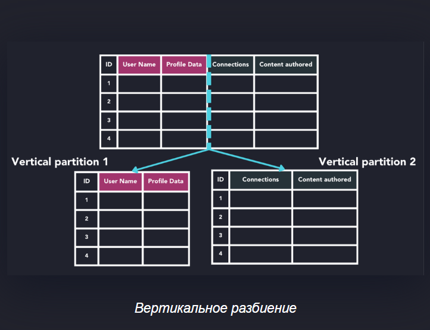
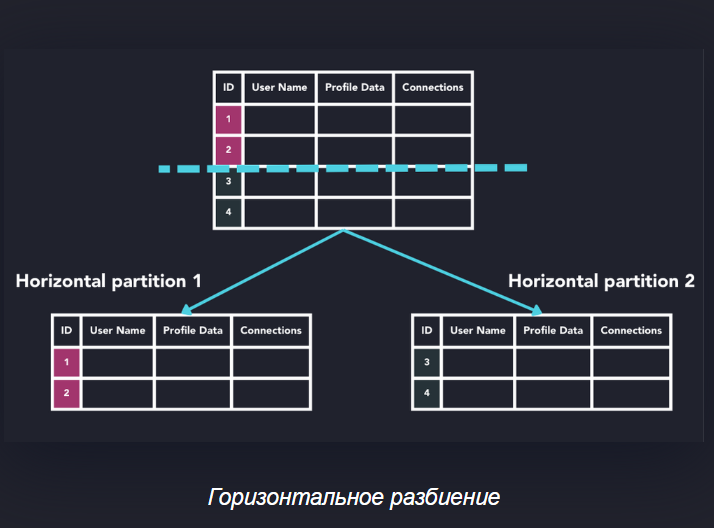

# Что такое партиционирование в базах данных и как это делать в PostgreSQL?
- Секционирование базы данных (или разбиение данных) — это метод, используемый для разделения данных в большой базе 
  данных на более мелкие фрагменты, называемые разделами. Каждый раздел затем хранится и используется отдельно, 
  что повышает производительность и масштабируемость системы базы данных.
- Партиционирование — это разделение большой таблицы на меньшие физические части (партиции), что улучшает 
  производительность и управляемость.
- Разделение базы данных (Партиционирование) имеет дело с одним экземпляром базы данных, тогда как шардинг разделяет 
  разделы (шарды) между несколькими экземплярами базы данных для масштабируемости и доступности.
- Каждая партиция содержит подмножество данных, определенное диапазоном значений, списком или хэшем.
- В PostgreSQL партиционирование задается при создании таблицы через `PARTITION BY`, пример партиционирования по диапазону даты:
```sql
CREATE TABLE measurement (
  city_id int NOT NULL,
  logdate date NOT NULL,
  peaktemp int,
  unitsales int
) PARTITION BY RANGE (logdate);
```
- Затем создаются отдельные таблицы-партиции для каждого диапазона:
```sql
CREATE TABLE measurement_2024_01 PARTITION OF measurement FOR VALUES FROM ('2024-01-01') TO ('2024-02-01');
```
- Партиционирование позволяет ускорять запросы, работающие с подмножеством данных, и облегчить управление ими.[5][6][7][8]

### Вертикальное разбиение
При вертикальном разбиении столбцы таблицы делятся на секции, каждая из которых содержит один или несколько столбцов таблицы. 
Такой подход полезен, когда к некоторым столбцам обращаются чаще, чем к другим.

- Разделение данных часто сочетается с шардингом: часто используемые столбцы можно разделить на отдельные разделы и шардировать для работы на отдельных серверах. В качестве альтернативы, редко используемые столбцы можно разделить на более дешёвое и медленное решение для хранения данных, чтобы снизить нагрузку на операции ввода-вывода.
- Один из недостатков вертикального секционирования заключается в том, что когда запрос должен охватывать несколько секций, объединение результатов из этих секций может быть медленным или сложным. Кроме того, по мере масштабирования базы данных может потребоваться ещё большее разделение секций для удовлетворения растущих потребностей.


### Горизонтальное разбиение

- Горизонтальное разбиение работает, разделяя таблицу по строкам на основе ключа разбиения. При этом каждая строка таблицы относится к разделу на основе определённых критериев


### 2. Партиционирование таблиц в PostgreSQL — делается на уровне SQL, в Kotlin просто работаете с основной таблицей.

Пример SQL для создания партиционированной таблицы:
```sql
CREATE TABLE measurement (
    id SERIAL PRIMARY KEY,
    city_id int NOT NULL,
    logdate date NOT NULL,
    temp int
) PARTITION BY RANGE (logdate);

CREATE TABLE measurement_2025_01 PARTITION OF measurement
FOR VALUES FROM ('2025-01-01') TO ('2025-02-01');

CREATE TABLE measurement_2025_02 PARTITION OF measurement
FOR VALUES FROM ('2025-02-01') TO ('2025-03-01');
```

Kotlin/Spring Boot код остается стандартным репозиторием для `measurement`:
```kotlin
@Entity
@Table(name = "measurement")
data class Measurement(
    @Id @GeneratedValue(strategy = GenerationType.IDENTITY)
    val id: Long = 0,
    val cityId: Int,
    val logdate: LocalDate,
    val temp: Int
)

interface MeasurementRepository : JpaRepository<Measurement, Long>
```
  
---

[5](https://questdb.com/glossary/database-partitioning/)
[6](https://postgrespro.ru/docs/postgresql/current/ddl-partitioning)
[7](https://www.postgresql.org/docs/current/ddl-partitioning.html)
[8](https://www.enterprisedb.com/postgres-tutorials/how-use-table-partitioning-scale-postgresql)

